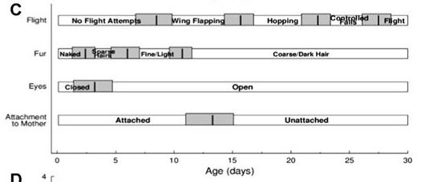
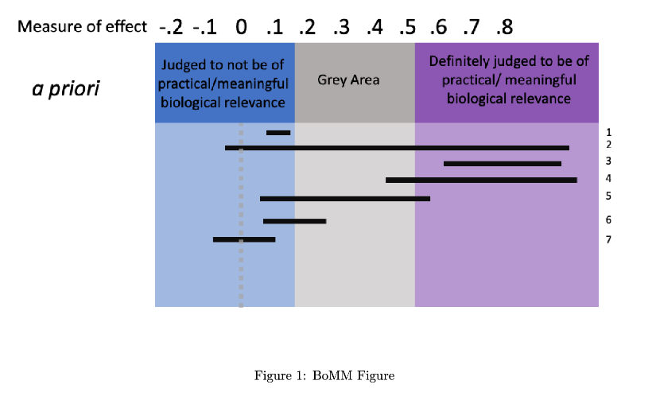

```{r setup, include=FALSE}
knitr::opts_chunk$set(echo = TRUE)
```

## Project Data
```{r, echo = TRUE}
dd <- readRDS("PupBirthdaysClean.rds")
summary(dd)
```
Note, here is a brief explanation of the variables: (1) **Bat.ID** is a subject identifier, (2) **Sex** is the sex of the pup and is attributed to the variable Bat.ID, (3) **Birthday** is a <date> variable that represents the date (yyyy-mm-dd) which each pup was born, (4) **Group** is a categorical factor, representing which group the pup was born into, (5) **Julian Date** corresponds to a different scale of birthday, taking into account that pups were all born within the same year (i.e. Julian Date goes from 0 [Jan 01] to 365 [Dec 31]), (6) **Sib.Sex** is the sex of the pups sibling (if applicable). Note, is typical of big brown bats in eastern temperate North America to give birth to twins, (7) **Switch** is a <date> variable that represents the first day the pup was found nursing on the opposite teat in which it was first observed nursing from.

## 1. Measurement

### Question 1a:
- **Theoretical Context:** The partution date for animals can be climate dependent. Here, we recorded the birthdays of the pups born to two separate groups: Wild-Caught and Captive.
- **Empirical Relational Structure:** We measured birthday using calendar date (i.e. yyyy-mm-dd). Since all bats were born within the same year, we are able to transform the data into a more meaningful scale - Julian Date - which represents the number of days elapsed since the beginning of the calendar year. Thus, this format sets a true 0 (i.e. 01-Jan-2023) and treats date as a continuous variable.
- **Numerical Relational Structure:** Because we are using Julian Date, we can assess this variable on the interval scale. The Group factor (i.e. Captive or Wild-Caught) would be assessed on the nominal scale.
- **Meaningful Inferences:** Birthdays may be bimodally distributed between groups and the difference in birthdays may be meaningful (i.e. if pregnant females are acclimatized to captivity, this may affect when they give birth). I would infer that there may be some overlap between the dsitributions 

### Question 1b:
Because *Group* is measured on a nominal scale, the only meaningful empirical operation I could use is assessing equivalence as any other comparison would require information that the measurement does not possess (e.g. magnitude). This scale does not permit calculations of Means and Variances as they would be meaningless.

Because *Birthday* is measured on an interval scale (i.e. the value of 0 does **not** mean a lack of the entity in question), it would be inappropriate to log-transform the data. Thus statements discussing ratio (e.g. there are 20% less...") would be meaningless as there is no true 0 defined. Even with the use of Julian Date (i.e. 0 = 01-Jan-2023), the value 0 still means that the pup would have a birthday - there is not a *lack of birthday*. The Julian Date transformation of data is meaningful and appropriate because the measurement remains unchanged (i.e. the distance between data points remain unchanged) and preserve the link between a measurement (now formatted as a continuous variable) and the reality they repersent (a value indicating the day the animal was born relative to other animals, and within a calendar year).

## 2. Effect Sizes and Meaningful Magnitudes

### Question 2a:
Note, I will consider my continuous response variable to be *Birthday* (in yyyy-mm-dd) and my predictors to be *Group* (either Captive or Wild-Caught) which can be found in the data frame *dd* 

For this data, I am examining the difference between birthdays between two groups - Captive and Wild-caught animals - to see if there is a meaningful effect of group on birthday. Note *Wild-Caught* animals were pups born from moms caught at a maternity roost in southern Ontario, Canada about three weeks before partuition whereas *Captive* animals wree pups born from moms that had been in captivity for an extended period of time during hibernation and prior to partution. 

For this data, I believe the most appropriate measure of effect size would be **Cohen's d**. Note, Cohen's d scales the differences in mean between group by the pooled standard deviation, which serves as a measur of biological variation.

### Question 2b: 
Note, simply taking the difference between means can be a perfectly reasonable measure of effect. As long as the units are meaningful and comparable, this can be used. Below shows the difference between the two means of Wild-Caught and Captive bats:
```{r, echo = FALSE}
t_useful_bits <- function(t_object) {
  return(c(
    t_object$estimate,
    difference = as.numeric(diff(t_object$estimate)),
    SE = t_object$stderr,
    CI = t_object$conf.int[1:2],
    t_object$statstic,
    t_object$parameter))}
```

```{r, echo = TRUE}
dd_diff_t_test <-t.test(Julian.Date ~ Group, alternative = "two.sided", data = dd)
t_useful_bits(dd_diff_t_test)
```
The difference in Means between Captive and Wild-Caught groups is 1.839, 95% CI [-2.946, -0.732].


This un-standardized measurement of effect size would be fine for this data. However, it limits the interpretation. For example, I may want to compare this data to other species of bats or even other mammals. These comparisons would be difficult given that meaningful scales may differ across different species. This rationale explains why I chose to use **Cohen's d**, because this measure of effect describes the differences in means (i.e. the general focus of my research question) while scaling by the pooled standard deviation (i.e. takes into conisderation the biological variation within the sample).  

``` {r, echo = TRUE}
library(effectsize)
cohens_d(Julian.Date ~ Group, data = dd)
```
Note, I would still want to report the differences in mean calculated above, for transparency.

### Question 2c:
I have chosen to use Cohen's d as my effect size estimate. 

One of the benefits of Cohen's d measurements is that it can easily be converted into other forms of test statistics (e.g. r statistics). Furthermore, Cohen's d has relatively easy interpretability when used appropriately, especially in the context of my esearch question (and most biological research questions).

### Question 2d: 

```{r, include=TRUE, fig.align="center", echo = FALSE, out.width= "400px", fig.cap=c("Figure 1: This Figure comes from Figure 1 in Mayberry and Faure (2014). It represents a timeline of important milestones in pup development for big brown bats. Horizontal bars represent different aspects of morphologial and behavioural changes: whether pup was found attached to the mother, the opening of the eyes, absence/presence of fur and type of haor, and flying ability. **black vertical lines** represent the mean age in days after birth when different milestones were achieved. *grey shading* represent +/- 1 standard deviation")}

```
A summary of these developmental milestones for big brown bats include:

- **Eyes:** eyes open at post natal dat (PND) 2/3
- **Hair:** grows sparse at PND 4, covers the body by PND 7/8, and becomes coarse by PND 8/9, and adult like-by PND 10/11
- **Flight:** pups make flight attempts around PND7/8 by flapping their wings while hanging. Pups begin hopping by PND 13, pefrom controlled falls / flight attempts by PND 21, and achieve true powered flight by PND 27/28.
- **Attachment to Mother:** pups tend to stop weaning by PND 13/14.

The authors suggest that "Because newborn pups are altrical they are very depedent on their mother for nutrition, warmth and protection and are consistently found attached to and nursing from her until PND 13/14" (Mayberry and Faure, 2014). For these reasons, I will designate the meaningfully relevant measure of effect to be set at 14 days (i.e. 2 weeks) as the pups development would be drastially lagged. I would designate the grey area to start at 7 days (i.e. 1 week)

For this reason, I will focus on the positive measure of effect, but these regions would be symmetrical around 0. Based on the developmental milestones presented in Mayberry & Faure (2014), I would designate an effect size of 14 days tohave meaingful biological relevance.


```{r, echo = FALSE, fig.cap=c("Figure 2: BoMM Figure created based on my own data")}
library(ggplot2)
Fig.02 <- ggplot() +
  theme(axis.text.y = element_blank(), axis.ticks.y = element_blank()) +
  scale_x_continuous(limits = c(0, 20), breaks = seq(0,20,1)) +
  ylab("") + xlab("Difference in Age (Days)") + ggtitle("Meaingful Measure of Effect for Pup Data:") +
  geom_vline(xintercept = 0, linetype = "dashed") + geom_rect(aes(xmin = 0, xmax = 7, ymin = 0, ymax = 10), fill = "blue", alpha = 0.5) +
  geom_vline(xintercept = 14, linetype = "dashed") + geom_rect(aes(xmin = 7, xmax = 14, ymin = 0, ymax = 10), fill = "grey", alpha = 0.5) +
  geom_vline(xintercept = 7, linetype = "dashed") + geom_rect(aes(xmin = 14, xmax = 20, ymin = 0, ymax = 10), fill = "purple", alpha = 0.5) +
  annotate("text", x = 3.5, y = 8, label = "Judged to not be of practical \n or meaningful biological \n relevance") +
  annotate("text", x = 10.5, y = 8, label = "Grey Area") +
  annotate("text", x = 17, y = 8, label = "Judged to be of practical \n or  meaningful biological \n relevance") 

Fig.02
```
**Citation:** Mayberry, HW and Faure PA. (2014). Morphological, olfactory, and vocal development in big brown bats. *Biology Open* 4(1), 22-34.

### Question 2e:
```{r, include=TRUE, fig.align="center", echo = FALSE, out.width= "400px", fig.cap=c("Figure 3: BoMM Figure included in Assignment")}

```
Below discusses my interpretation and inferences I would draw from the following estimates:

Note, estimates 1, 3, 4, 5, and 6 would all be deemed statistically significant through means of null hypothesis significance testing (NHST), however there is a more meaningful interpretation of these estimates when attributed to a meaningful measure of effect.

- **Estimate 1:** This estimate is a small, positive effect of mutant type 1. However, this estimate is not considered **meaningful** in biological context. There is a lot of precision in this estimation (i.e. there is a high degree of certainty for this estimate). 
- **Estimate 2:** This estimate is a large effect of mutant type 2. Note, it is not appropriate to say this estimate is positive, as the confidence interval overlaps 0. This estimate contains a wide range of values in all regions.
- **Estimate 3:** This estimate is a large, positive, and meaningful effect of mutant type 3. Note, the estimate has been deemed biologically meaningful based on observations within the field. 
- **Estimate 4:** This estimate is also a large, positive, and arguably a meaningful effect of mutant type 4. Unlike Estimate 3, this estimate breaches into the *Grey Area*, suggesting that there is more uncertainty regarding the meaningfulness of this effect. However, it is important not to treat the boundaries between the different areas as definitive - otherwise you are essentially reproducing the same issues associated with significance testing (i.e. dichotomous decision, 'p-value reliance', etc.) within the effect size estimates. Note, the majority of the confidence interval breeches the *meaningful* bounds. Therefore, I would treat my interpretation of this estimate similar to that of Estimate 3.
- **Estimate 5:** This estimate is a small, positive effect of mutant type 5. The interpretation of estimate 5 should be done with caution because (1) the confidence intervals spread over multiple ranges including values that are not meaningful, grey area, and biologically meaningful values. In other words, there is a high degree of uncertainty associated with estimate 5. I would be interested to see where the estimate value lies within the 95% confidence interval (i.e. is it skewed in one direction), but I will assume that it  lies in the middle - within the grey area. 
- **Estimate 6:** This estimate is a small, positive effect of mutant type 6, and is most similar  to estimate 1. However, the interpretation of this estimate may differ slightly as it contains values in the *Grey Area* and might have different implications
- **Estimate 7:** This estimate is a relatively small effect of mutant type 7. Similar to estimate 2, it would be inappropriate to say this effect is positive/negative as the confidence intervals overlap 0. 


Of course, I would not to make definitive conclusions off of levels of uncertainty (i.e. 95% confidence inbtervals) and instead make inferences from these estimates. I would also not want to make absolute thresholds of the barriers between regions (not meaningful, grey area, and meaningful) as this would be recreating the dichotomy problem associated with p-value decision making (loss of infromation). Itis *important** to draw inferences from all of the information provided in estimate intervals. 